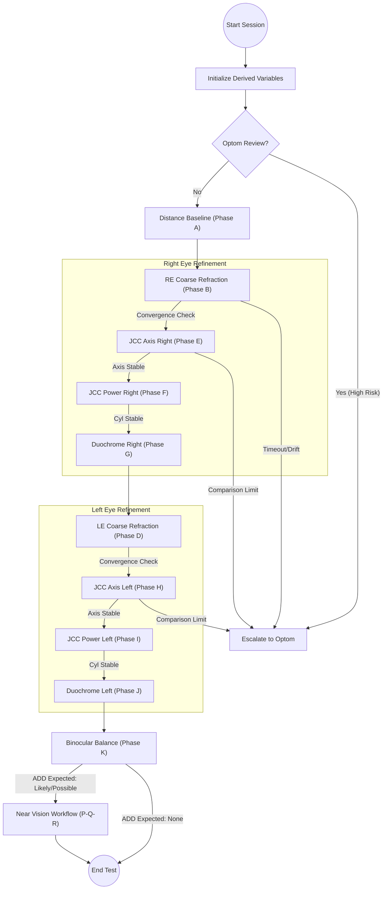

# Eye Test Engine (FSM_v2) - Excel-Driven Logic & Journey

This document details the refined logical flow and "smart" decision-making rules derived from the **FSMv2.2.xlsx** specifications. This logic introduces dynamic personalization based on patient profile and risk assessment.

## 1. New Logical Flow Diagram (FSMv2.2)

---

## 2. Additional Logic Per Phase (Excel Enhancements)

Compared to the previous implementation, the following "Smart" logics have been added to each phase:

### Phase A: Distance Vision Baseline
- **Gating**: Uses `dv_requires_optom_review` (derived from symptoms like Diplopia or Sudden Vision Loss). If TRUE, the session immediately escalates.
- **Dynamic Baseline**: Captures baseline VA to set the `target_va` for subsequent refraction phases.

### Phase B/D: Coarse Refraction (RE/LE)
- **Starting Point Source Policy**: Instead of always starting at 0, it dynamically chooses between **Start_AR**, **Start_Lenso**, or **Hybrid** (Mean of both) based on patient satisfaction and mismatch levels.
- **Fogging Strategy**: Introduces `dv_fogging_policy`. Presbyopes or High-Risk patients get **Strong Fog** (+1.00D shift), while stable adults might get **No Fog**.
- **Drift Monitoring**: Uses `dv_max_delta_from_start_sph` (e.g., 2.00D). If the refraction drifts too far from the initial measurement, it flags an anomaly.

### Phase E/H & F/I: JCC Axis & Power
- **Convergence Tolerance**: Introduces `dv_axis_tolerance_deg` (1°, 3°, or 5°) and `dv_cyl_tolerance_D`. The system no longer just waits for a reversal but checks if the adjustment is within a specific "Fine" or "Normal" tolerance.
- **Step Policy**: `dv_axis_step_policy` allows for **Fine** (1°) increments for unstable/high-risk eyes, vs standard 5° increments.
- **Comparison Limits**: Added a `comparisons > limit` guard. If the patient is indecisive for too many flips, the system triggers `ACCEPT_BEST` or `ESCALATE` rather than looping infinitely.

### Phase G/J: Duochrome
- **Adaptive Flip Count**: `dv_duochrome_max_flips` limits the refinement cycle (2-4 flips) based on the patient's stability level to prevent "over-refining" unstable eyes.

### Phase K: Binocular Balance
- **Near Vision Gating**: Uses `dv_add_expected`. It checks the patient's age (>=40) and current wear type to decide if the test is complete or if it must proceed to Near ADD phases.

### Phase P/Q/R: Near ADD
- **Presbyope Logic**: Mandatory for users in the "Presbyope" bucket. Includes individual eye ADD determination followed by Binocular Near Verification.

---

## 3. Global Logic Variables (New)

| Variable | Description | Impact |
| :--- | :--- | :--- |
| **dv_confidence_requirement** | High / Medium / Low | Determines how many "confirmations" the patient must give before a value is accepted. |
| **dv_branching_guardrails** | Strict / Relaxed | Controls how sensitive the FSM is to "Unable to read" vs "Blurry" responses. |
| **timeout_bucket** | Fast / Normal / Slow | A phase-level timer. "Quick" patients are handled with less confirmation; "Slow" patients trigger escalation sooner. |
| **dv_endpoint_bias_policy** | Neutral / Undercorrect | For night drivers, it might bias towards slight over-correction; for presbyopes, towards slight under-correction for comfort. |

---

## 4. Pending Questions for Clarification

1.  **Escalation Protocol**: In the [FSMv2.2.xlsx](file:///Users/shantanuchandra/Downloads/eyetest-2/FSMv2.2.xlsx), several triggers result in `ESCALATE`. In a live session, should the UI "Lock" and wait for a manual Optom unlock, or just log a high-priority "QA Marker" and continue?
2.  **Hybrid Start Calculation**: For `dv_start_rx_RE_sph`, the logic says `mean(AR, Lenso) rounded to 0.25`. Should this rounding always be "Towards Zero" (Cautious) or "To Nearest"?
3.  **Timeout Action**: If a phase reaches `TIMEOUT`, the action is `ACCEPT_BEST`. How should "Best" be determined? Should it be the baseline AR/Lenso value or the last value the patient said was "Clear"?
